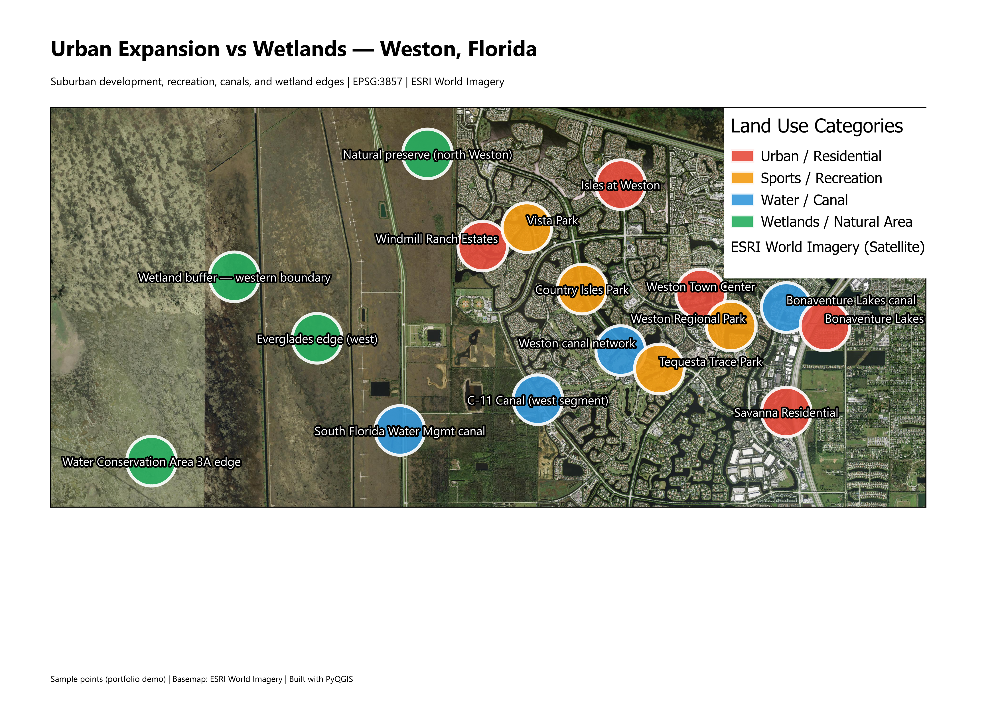

# Urban Expansion vs Wetlands — Weston, Florida

A **QGIS / PyQGIS** portfolio project that visualizes the spatial contrast between suburban development, sports and recreation areas, water canals, and wetland edges around **Weston, Florida** (Broward County).



> **Note:** Run the build script once in QGIS to generate `screenshots/weston_map_overview.png` and other outputs. Until then, the image above will appear broken on GitHub.

---

## Project description

Weston is a master-planned suburban city on the edge of the Everglades. Its landscape mixes **dense residential neighborhoods**, **parks and sports facilities**, an extensive **canal network** for flood control, and **wetland conservation areas** to the west. This project maps representative sample locations in each category on a **satellite basemap**, using consistent symbology and labels suitable for planning, environmental, or GIS portfolio review.

The analysis is **illustrative** (point-based sample data, not a full land-cover classification). It is designed to demonstrate GIS workflow, cartography, and automation skills rather than to replace official environmental inventories.

---

## Methodology

| Step | Action |
|------|--------|
| 1 | Initialize a new QGIS project with **EPSG:3857** (Web Mercator) for XYZ tile compatibility |
| 2 | Add **ESRI World Imagery** as an XYZ satellite basemap |
| 3 | Create four **in-memory point layers** (Urban, Sports, Water, Wetlands) in **EPSG:4326** |
| 4 | Place **sample points** with names and WGS84 coordinates around Weston |
| 5 | Apply **category-specific colors and marker sizes** |
| 6 | Enable **labels** from the `name` attribute (white text, dark buffer) |
| 7 | Set the **map extent** to the study area with padding |
| 8 | Build an **A4 landscape print layout** (title, map, legend, attribution) |
| 9 | **Export** a 300 DPI PNG and **save** the `.qgz` project |

Coordinates are approximate portfolio demo points. For production work, you would use verified parcels, OpenStreetMap, FWC wetlands, or South Florida Water Management District layers.

---

## Tools used

- **[QGIS](https://qgis.org/)** 3.x — Desktop GIS, layouts, symbology
- **[PyQGIS](https://docs.qgis.org/latest/en/docs/pyqgis/)** — Python API for project automation
- **Python 3** — Scripting (bundled with QGIS)
- **[ESRI World Imagery](https://www.arcgis.com/home/item.html?id=10df2279dc00842e814deeb5e8f7fe1c)** — XYZ satellite basemap (portfolio / educational use; review [Esri terms](https://www.esri.com/en-us/legal/terms/full-master-agreement) for commercial use)

---

## Skills demonstrated

- PyQGIS project lifecycle (`QgsProject`, layers, CRS)
- XYZ raster basemap integration
- In-memory vector layer creation and attribute design
- Coordinate reference systems (WGS84 points in a Web Mercator project)
- Thematic symbology (color, size, stroke)
- Map labeling (`QgsPalLayerSettings`)
- Print layouts and high-resolution export (`QgsLayoutExporter`)
- Reproducible, commented scripting for GIS portfolios

---

## AI training relevance

This repository is structured as **clear, documented geospatial code** with:

- Explicit step numbering and function boundaries
- Named categories and human-readable point labels
- A repeatable build script (same inputs → same map outputs)

That makes it useful as **training or evaluation material** for models learning to:

- Generate valid PyQGIS from natural-language GIS requirements
- Explain CRS choices (4326 vs 3857) in web-mapping contexts
- Structure portfolio READMEs (methodology, tools, limitations)
- Distinguish demo sample data from authoritative environmental datasets

If you use this repo in a dataset, please cite the project and note that sample coordinates are not certified survey data.

---

## Repository structure

```
urban-expansion-wetlands-weston/
├── README.md                 # This file
├── requirements.txt          # Environment notes (QGIS-provided Python)
├── scripts/
│   └── build_weston_project.py   # Main PyQGIS build script
├── screenshots/              # Images for GitHub / portfolio
│   ├── README.md               # What to capture for screenshots
│   └── weston_map_overview.png # Generated by script (after first run)
├── output/                     # Generated by script (gitignored optional)
│   ├── weston_urban_wetlands.qgz
│   └── weston_urban_wetlands_map.png
└── .gitignore
```

### Screenshots folder

After running the script, add optional captures for your portfolio:

| File | Suggested content |
|------|-------------------|
| `weston_map_overview.png` | Auto-exported layout map (script) |
| `qgis_canvas.png` | QGIS main window with layers and labels |
| `print_layout.png` | Layout designer view |
| `layer_styling.png` | Symbology panel for one category |

See [screenshots/README.md](screenshots/README.md).

---

## Requirements

- **QGIS 3.44+** (script updated for current PyQGIS API; 3.22+ may work with older enum names)
- **Internet access** (for ESRI XYZ tiles on first load)
- **Windows / macOS / Linux** — same script in QGIS Python Console

No separate `pip install` is required for PyQGIS; use the Python environment shipped with QGIS.

---

## How to run

### Option A — Script Editor (recommended)

1. Install and open **QGIS Desktop**.
2. Go to **Plugins → Python Console** (`Ctrl+Alt+P`).
3. Click **Show Editor** (paper icon).
4. Open `scripts/build_weston_project.py`.
5. Click **Run Script**.

### Option B — Python Console one-liner

Adjust the path to match your machine:

```python
exec(open(r'D:/Panka/Trabalhos/QGIS/urban-expansion-wetlands-weston/scripts/build_weston_project.py', encoding='utf-8').read())
```

### Option C — Processing Toolbox (optional)

1. **Processing → Scripts → Create New Script…**
2. Paste the script contents, save, then run from the Processing Toolbox.

### Expected output

Console messages `[1/9]` … `[9/9]`, then:

- `output/weston_urban_wetlands.qgz`
- `output/weston_urban_wetlands_map.png`
- `screenshots/weston_map_overview.png`

Open the `.qgz` file in QGIS to explore layers, layouts, and styling.

---

## Customization

Edit the top of `scripts/build_weston_project.py`:

- **`SAMPLE_POINTS`** — add or change locations `(name, lon, lat)`
- **`CATEGORY_STYLE`** — colors (`#hex`) and marker sizes (mm)
- **`PROJECT_CRS`** — keep `EPSG:3857` for web tiles, or switch project to `EPSG:4326` if you drop the basemap

---

## Limitations

- Sample points are **not** from official land-use databases.
- ESRI tiles require network access and are subject to **provider terms**.
- No buffering, overlay analysis, or change detection — extend the script for deeper analysis.

---

## License

Code and documentation: **MIT** (see `LICENSE` if present).  
Basemap imagery: **Esri / respective providers** — follow their attribution and usage policies in any public map.

---

## Author

Portfolio geospatial project — **QGIS + PyQGIS + Python**.  
Study area: **Weston, Florida, USA**.
